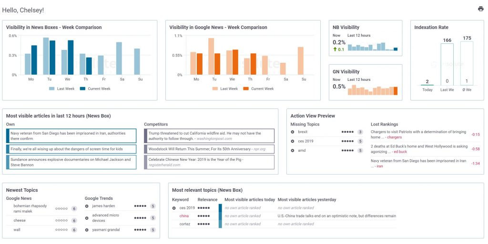

# News Aggregator

- Repository: `news dashboarding`
- Type of Challenge: `Consolidation`
- Duration: `5 days`
- Deadline: `15/12/2023 17:00`
- Team challenge : Team (mixed data engineer and data analysts)

## Learning objectives
| **Data Engineers**            | **Data analysts**           |
|-------------------------------|-----------------------------|
| Scrape websites               | Define needs for reporting  |
| Find and use news API         | Organize project with DE    |
| Store documents               | Explore documents from storage  |
| schedule process              | Create insightful dashboard |
| Deal with document versioning | Create tag cloud            |

## The Mission

One of our clients wants to create a dashboard that can give them interesting information about what makes the newspaper headlines.
To achieve this goal, we've gathered different teams of data analysts and data engineers.
They will have to find sources that they can use and create an insightful dashboard

### Sources 

Define with your team what type of sources and what kind of information you want to gather.
Based on that, you'll decide where you want to take your information : 
- rss feeds from  
  - newspapers (i.e [N-Y times](https://www.nytimes.com/rss)) 
  - rss database (i.e [feedspot](https://rss.feedspot.com/world_news_rss_feeds/))
- website scraping (newspapers, goolge news, etc.)
- opensource database (/!\ up to date ?)
- etc.

The important information to retrieve are : 
- source of the news (newspaper, etc)
- country 
- topics 
- title 
- article (or at least header / summary)

  
### Data pipeline
Create a data pipeline that allow you to
- gather information from your sources
- store them (you need to decide what technology to use)
- schedule the update of your database
- be careful with the versioning of the dataset

### Dashboard
Create a dashboard that allow you to monitor the news. For instance : 
- what are the hot topics by country ?
- how many articles published by country (by topic ?)
- etc.
- Optional and nice to have : recommend similar articles

### Presentation
Create a small presentation (max. 6 slides) explaining your choices (which sources? what technology ? what information?) and why you did it. 
The presentation should also show your dashboard specificity and its functionalities.

## Deliverables

1. Publish your source code on a GitHub repository.

2. Presentation

3. Link to a public dashboard (optional)

## Steps

1. Plan the work and organize your team
    - sketch your dashboard 
    - identify your needs
    - present it to the coach
    - distribute the team roles : 
        - **Github Manager** : make sure the github repo stays clean and branches are properly created and merged.
        - **Project Manager** : make sure everybody in the team stays focus on the goal and is working towards its achievement.
        - **Presentation Manager** : make sure that the presentation is professional and that everything needed for that presentation is available.
2. Look for sources 
3. Build the pipeline
4. Analyze the data and create the dashboard

## Evaluation criteria

| Criteria       | Indicator                                  | Yes/No |
| -------------- | ------------------------------------------ | ------ |
| 1. Is complete | The data pipeline is complete       | [ ]    |
|                | The dashoard is updated daily with new content          | [ ]    |
|                | You have a nice presentation       | [ ]    |
| 2. Is great    | You can recommend similar articles | [ ]    |
|               | You have creative information to show  | [ ]    |

## A final note of encouragement

_“If you don't read the newspaper, you're uninformed. If you read the newspaper, you're mis-informed.”_
_- Mark Twain_
**Nooow.. go get some news!!**

